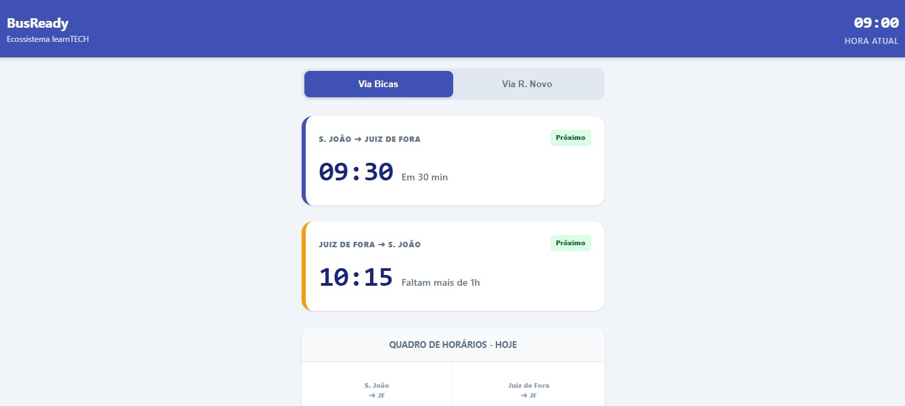

# BusReady 🚌

> Parte do Ecossistema **learnTECH**

O **BusReady** é um Web App mobile-first projetado para passageiros da linha S. João Nepomuceno x Juiz de Fora. Ele resolve o problema de saber exatamente quanto tempo falta para o próximo ônibus, mesmo em condições de baixa conectividade.

---

## 🛠️ Tecnologias Utilizadas

- **Vue 3 (Composition API):** Estrutura reativa e modularizada.
- **TypeScript:** Segurança e tipagem para a base de horários.
- **Vite:** Build ultra-rápido e gerenciamento de assets.
- **Vanilla CSS (Custom Properties):** Design System customizado para máxima performance e compatibilidade.
- **Vite Plugin PWA:** Suporte a funcionamento offline e instalação como App nativo.

---

## 🧠 Lógica do Projeto

A "Engine" do projeto baseia-se em três pilares reativos:

1.  **Relógio Mestre (`useTime.ts`):** Provê um pulso constante do horário atual, permitindo que o app atualize a contagem regressiva em tempo real sem a necessidade de refresh.
2.  **Motor de Cálculo (`useBusLogic.ts`):** Cruza o horário atual com o banco de dados `schedules.json`. Ele realiza a filtragem de horários passados e identifica a próxima partida baseada na "Via" selecionada (Bicas ou R. Novo).
3.  **Estados de Urgência:** A interface reage dinamicamente ao tempo restante. Se a diferença for $\le 10$ minutos, o sistema ativa o estado crítico (animação de pulso e cores de alerta).

---

## 🚀 Plano de Execução

### 1. Marco: Configuração e Infraestrutura

- [x] Inicialização com Vite e Vue-TS.
- [x] Configuração do Design System (Cores Brand, Status, Accent).
- [x] Verificação de ambiente e hot-reload.

### 2. Marco: Camada de Dados e Lógica

- [x] Mapeamento de horários em `schedules.json`.
- [x] Implementação do Composable de tempo.
- [x] Implementação dos filtros de busca do próximo ônibus.

### 3. Marco: Desenvolvimento da Interface (UI/UX)

- [x] Layout mobile-first responsivo.
- [x] Cards de destaque com contagem regressiva.
- [x] Quadro de horários completo e dinâmico.

### 4. Marco: Transformação em App (PWA)

- [ ] Configuração do Manifesto (Ícones e Cores).
- [ ] Estratégia de Cache para funcionamento Offline.
- [ ] Validação de persistência de dados.

---

## 📈 Próximos Passos (Backlog)

- **Offline-First:** Garantir que o passageiro veja o quadro de horários mesmo sem sinal de internet no ponto.
- **Geolocalização:** Identificar automaticamente se o usuário está em Bicas ou R. Novo para sugerir a melhor rota.
- **Modo Noturno:** Ajuste automático de contraste para facilitar a leitura em ambientes escuros.
- **Notificações:** Alerta sonoro ou push quando faltarem 5 minutos para a partida.

---

## 🛡️ Checklist de Qualidade

- [ ] **Responsividade:** Layout testado em iPhone SE e dispositivos Android.
- [ ] **Acurácia:** Horários validados com a tabela oficial da Matriz Bassamar.
- [ ] **Performance:** Carregamento instantâneo de assets estáticos.
